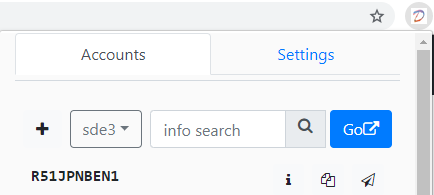

# net-pilot-chrome-tool-react

> Chrome extension for local E2E

## Getting Started
 
support DSP log on in 2.0.3 !!!

1. Tick Devloper mode in chrome extension tab.

2. Click "Load unpacked extension" and select the root folder for this project.

3. You can add your profile in debuger tool and log in by debug tool.

4. Click go button to debug in localhost.

